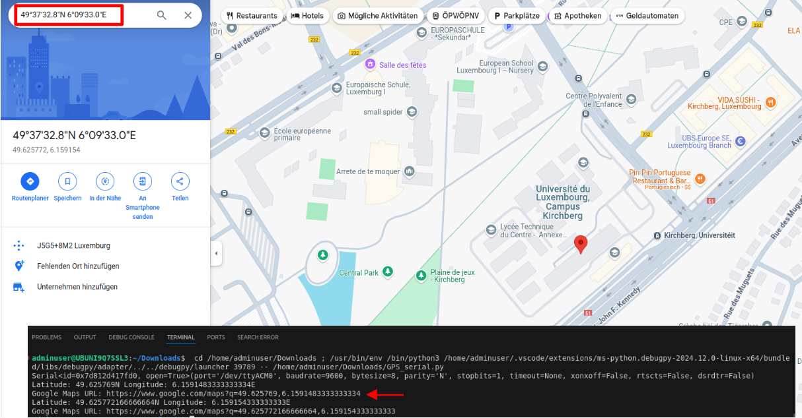

# GeoLinker


This simple code will allow you to receive GPS data continuously and generate a Google Maps link, so you can develop a real-time tracking system using devices such as a Raspberry Pi.

## Technical details

* [VK-162 GPS](https://www.amazon.de/-/en/dp/B078Y52FGQ/?coliid=I215D1V6IYAZN3&colid=368ECSMP72QO3&ref_=list_c_wl_lv_ov_lig_dp_it&th=1) dongle navigation module external GPS antenna. 


## Getting started

These instructions will allow you to have a copy of the code on your local computer for development and testing purposes.

The tests were performed using an inexpensive GPS, for greater accuracy you can use an RTK GPS system.


### Prerequisites

This is the basic information required to set up a suitable development environment.

You first need to have Python 3 and Pip 3 installed in your computer. Check here for the proper instructions and code:
```
https://www.python.org/download/releases/3.0/

$ sudo apt install python3
$ sudo apt install python3-pip
```

Install HWINFO, to find out which port the operating system assigned to your GPS.
```
$ sudo apt install hwinfo
```

Run the following command to find out which port was assigned, it should be something like /dev/ttyACM0.
```
$ sudo hwinfo --short 
```

Give read and write permissions to that port, with the following command:
```
$ sudo chmod a+rw /dev/ttyUSB0
```

NOTE: Replace the port in the code if necessary.


## Experimental

If you have given the necessary permissions to the USB port and installed everything correctly, just run the `GPS_serial.py` file, and the data from your device should start to be received.

This image shows an example of the device receiving coordinates and displaying the Google Maps link.




## Authors

* **Kiyoshy Nakamura**

## License

This project is licensed under the GNU GPLv3 - see the [LICENSE](LICENSE) file for details.